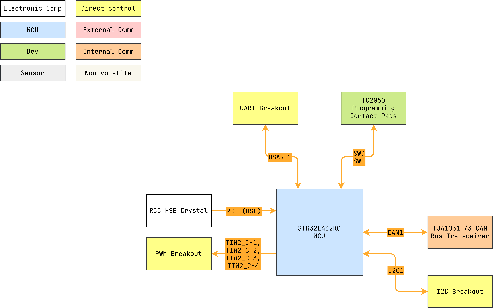

# pwm_node


Firmware for CAN-controlled PWM controller.

- PCB: [`pwm_node_pcb`](https://github.com/danielljeon/pwm_node_pcb).

---

<details markdown="1">
  <summary>Table of Contents</summary>

<!-- TOC -->
* [pwm_node](#pwm_node)
  * [1 Overview](#1-overview)
    * [1.1 Bill of Materials (BOM)](#11-bill-of-materials-bom)
    * [1.2 Block Diagram](#12-block-diagram)
    * [1.3 Pin Configurations](#13-pin-configurations)
    * [1.4 Clock Configurations](#14-clock-configurations)
  * [2 TJA1051T/3 CAN Bus Transceiver](#2-tja1051t3-can-bus-transceiver)
  * [3 PWM Breakouts](#3-pwm-breakouts)
    * [3.1 Clocks](#31-clocks)
    * [3.2 Pulse Width Modulation (PWM) Timer](#32-pulse-width-modulation-pwm-timer)
      * [3.2.1 Timer Calculations](#321-timer-calculations)
    * [3.3 Direct Memory Access (DMA)](#33-direct-memory-access-dma)
<!-- TOC -->

</details>

---

## 1 Overview

### 1.1 Bill of Materials (BOM)

| Manufacturer Part Number | Manufacturer       | Description         | Quantity | Notes |
|--------------------------|--------------------|---------------------|---------:|-------|
| STM32L432KC              | STMicroelectronics | 32-bit MCU          |        1 |       |
| TJA1051T/3               | NXP USA Inc.       | CAN Bus Transceiver |        1 |       |

### 1.2 Block Diagram



> Drawio file here: [pwm_node.drawio](docs/pwm_node.drawio).

### 1.3 Pin Configurations

<details markdown="1">
  <summary>CubeMX Pinout</summary>


</details>

<details markdown="1">
  <summary>Pin & Peripherals Table</summary>

| STM32L432KC | Peripheral       | Config             | Connection                | Notes |
|-------------|------------------|--------------------|---------------------------|-------|
| PB3         | `SYS_JTDO-SWO`   |                    | TC2050 SWD Pin 6: `SWO`   |       |
| PA14        | `SYS_JTCK-SWCLK` |                    | TC2050 SWD Pin 4: `SWCLK` |       |
| PA13        | `SYS_JTMS-SWDIO` |                    | TC2050 SWD Pin 2: `SWDIO` |       |
| PA11        | `CAN1_RX`        |                    | TJA1051T/3 Pin 1: `TXD`   |       |
| PA12        | `CAN1_TX`        |                    | TJA1051T/3 Pin 4: `RXD`   |       |
| PA5         | `TIM2_CH1`       | PWM Generation CH1 | Breakout                  |       |
| PA1         | `TIM2_CH2`       | PWM Generation CH2 | Breakout                  |       |
| PA2         | `TIM2_CH3`       | PWM Generation CH3 | Breakout                  |       |
| PA3         | `TIM2_CH4`       | PWM Generation CH4 | Breakout                  |       |
| PB7         | `USART1_RX`      |                    | TBD                       |       |
| PB6         | `USART1_TX`      |                    | TBD                       |       |
| PA9         | `I2C1_SCL`       |                    | TBD                       |       |
| PA10        | `I2C1_SDA`       |                    | TBD                       |       |

</details>

### 1.4 Clock Configurations

```
8 MHz High Speed External (HSE)
↓
Phase-Locked Loop Main (PLLM)
↓
80 MHz SYSCLK
↓
80 MHz HCLK
↓
 → 80 MHz APB1 (Maxed) → 80 MHz APB1 Timer
 → 80 MHz APB2 (Maxed) → 80 MHz APB2 Timer
```

---

## 2 TJA1051T/3 CAN Bus Transceiver

Carry over from [nerve](https://github.com/danielljeon/nerve).

---

## 3 PWM Breakouts

### 3.1 Clocks

`APB2`: 80 MHz (clock for TIM2 PWM output channels).

### 3.2 Pulse Width Modulation (PWM) Timer

#### 3.2.1 Timer Calculations

Given the PWM equation:

$$f_{PWM} = \frac{f_{TIM}}{ \left( ARR + 1 \right) \times \left( PSC + 1 \right) }$$

- $f_{TIM} = 1 \space \mathrm{MHz}$
    - Choosing 1 MHz (1 µs per tick) to simplify calculations.
- $ARR = 20000 - 1$
    - Counter period, aka Auto Reload Register (ARR) of 19999 is used to
      simplify the translation of 1 ms and 2 ms pulse widths.
- $f_{PWM} = 1 \space \mathrm{MHz}$
    - Aiming for 1 µs ticks, or $1 \times 10 ^{-6} \space \mathrm{s}$.
    - Calculating for required PWM frequency:
        - $f_{PWM} = \frac{1}{1 \times 10 ^{-6} \space \mathrm{s}} = 1 \space \mathrm{MHz}$

Thus, the prescaler, $PSC = 80 - 1$.

With these settings the following PWM values can be obtained:

```
1 ms -> CCR = 1000
1.5 ms -> CCR = 1500
2 ms -> CCR = 2000
```

### 3.3 Direct Memory Access (DMA)

`TIM2_UP` `DMA1 Stream2`:

- Direction: `Memory to Peripheral`.
- Mode: `Circular`.
    - Application is PWM servos.
- Peripheral Increment Address: `Disabled`.
- Memory Increment Address: `Enabled`.
- (Both Peripheral and Memory) Data Width: `Word`.
- Use FIFO: `Disabled`.
